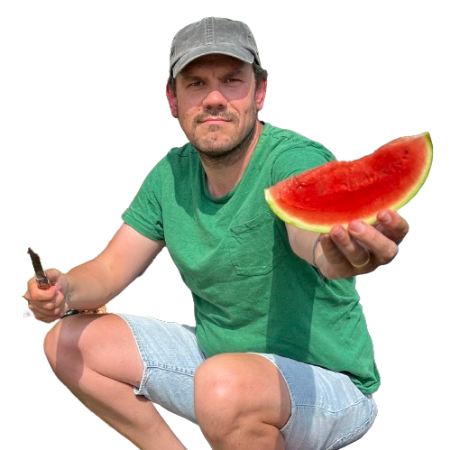

# Erik van Zuijdam

Welcome to my Github pages. You can visit my my [Github repository](https://github.com/Zuijdam/) to look at the rather boring source of this page.

Visit my [LinkedIn](https://www.linkedin.com/in/zuijdam) profile to learn more about my professional life and also get in touch if you think I should work for you or have interesting opportunities.

At the [digitaletuin](https://www.dedigitaletuin.nl) (digital garden) I post all my different little site projects. Feel free to browse around and be amazed :)

I can be found on some social media like [Mastodon](https://indieweb.social/@bonzz), [Bluesky](https://zuijdam.bsky.social) and if your are really feeling lucky you can try my [Matrix](https://matrix.to/#/@bonzz:matrix.org) account. Also nice to know, I am the co-founder of the [Geensnor.nl](https://www.geensnor.nl) website and [Geensnor cycling team](https://www.omloopdesnor.nl)

